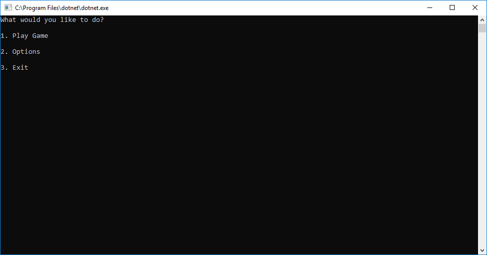
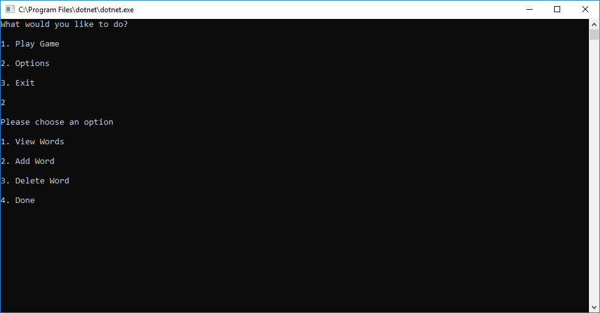
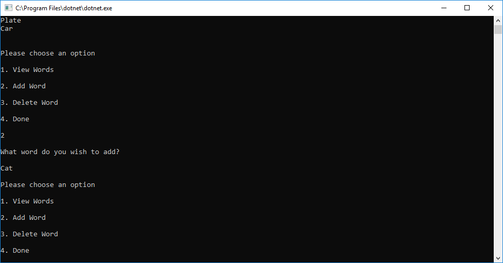
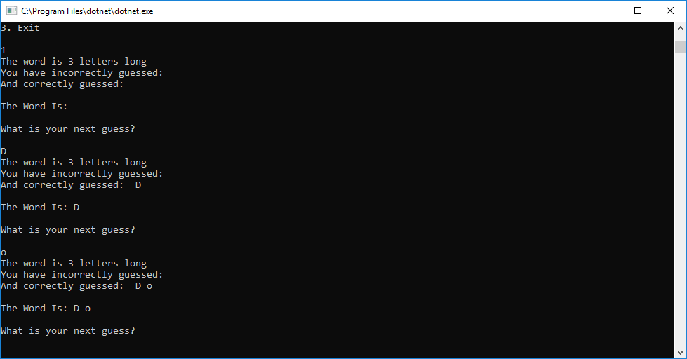
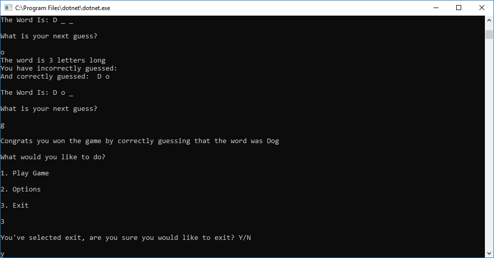

# Word Guessing Game
#### Lab03-WordGuessingGame
##### Author: Daniel Logerstedt

------------------------------

## Description

This application is a C# console application that runs a guessing game using words pulled from a file. It has the ability to add and delete words from that file as well as play the game which involves guessing one letter at a time till the word is discovered.

------------------------------

## Getting Started
Clone this repository to your local machine.
```
$ git clone 
```
#### To run the program from Visual Studio:
Select ```File``` -> ```Open``` -> ```Project/Solution```

Next navigate to the location you cloned the Repository.

Double click on the ```Lab03-WordGuessGame``` directory.

Then select and open ```WordGuessGame.sln```

Select ```Debug``` -> ```Run without Debugging```

------------------------------

## Visuals

##### Application Start

##### Using the Application



##### Application End


------------------------------

## Change Log

